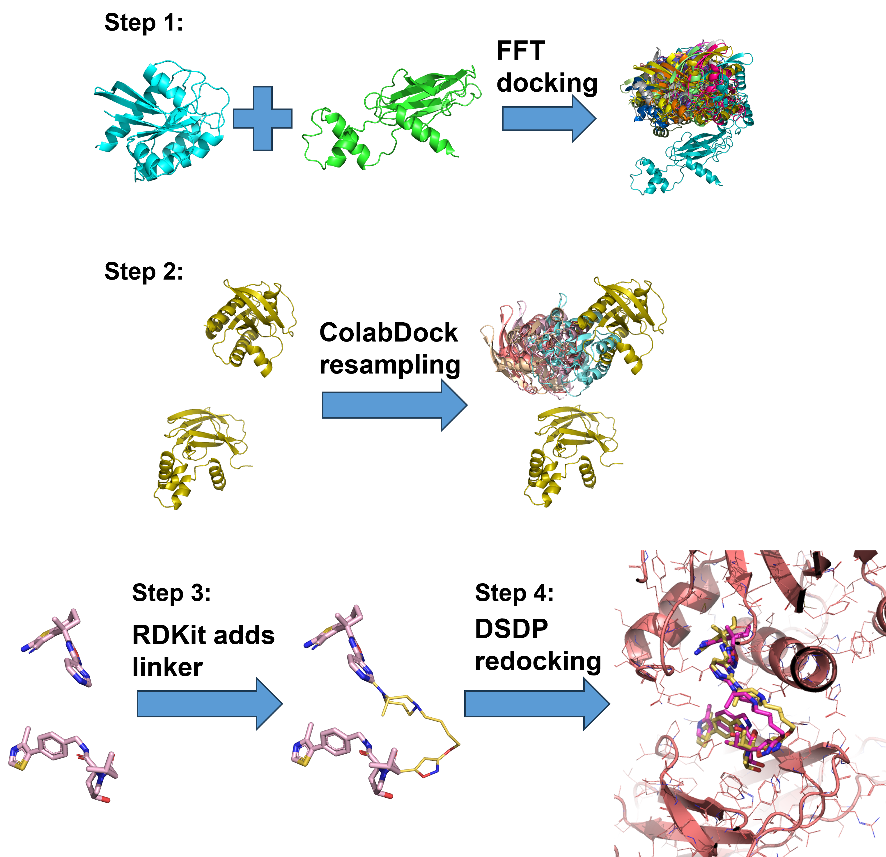

# PROTAC-shotgun
Shotgun approch for modeling of POI-PROTAC-E3 ternary complex.

Scripts for FFT-based protein-protein docking is modified on the codes from github repository https://github.com/shannontsmith/fft-docking. The original idea is from the following 1992 PNAS paper:

>Katchalski-Katzir, E., et al. (1992). "Molecular surface recognition: determination of geometric fit between proteins and their ligands by correlation techniques." Proc Natl Acad Sci U S A 89(6): 2195-2199.

The code of DSDP is modified to use the input coordinates as the initial guess for conformation sampling. You can find the instructions for installment of DSDP from https://github.com/PKUGaoGroup/DSDP.

The code of ColabDock is also modified to use the input coordinates as the initial guess for conformation sampling. The output from each iteration is saved, and the second stage (prediction stage) of ColabDock is not run. You can find the instructions for installment of ColabDock from https://github.com/JeffSHF/ColabDock.

# Workflow

# Instructions to Run This Example
The codes and 1 test case 8QW7 were uploaded. Follow the instructions bellow to run the test case:

## Step 1:  
Go to folder "FFT Docking/8QW7".  
Use the command in "FFT Docking/8QW7/cmds" to do FFT-based docking for POI and E3.  
***python fft_opencl.py -p 8qw7_B.pdb -l 8qw7_A.pdb -angs_per_vox 1 -rot_angle 30 -nstruct 100000 -dist 5 -opencl***  
**-p** and **-l** is used to spicify the POI and E3. The order is irelevant. In this test case, 8qw7_B.pdb is VHL, and 8qw7_A.pdb is POI.  
**-angs_per_vox** is for the distance between grid points. 1 Å is use for this case.  
**-rot_angle** is rotation step. At the beginning of FFT docking, one protein is fixed, the other is rotated about three axixes to generated all possible orientations.  
**-nstruct** is the number of output pose.  
**-dist** is to define the area near pocket.  

There is a config.py in folder "FFT Docking/8QW7" containing some other parameters (residues near the pockets, values for different types of grid, thresholds that filter out undesired orientations).  

Run the following two notebooks to align and cluster all the poses:  
**alignment_after_docking.ipynb**  
**clustering_after_alignment.ipynb**  
Move all clustered results to a new folder “ColabDock/8QW7/PROTAC_8QW7_results/FFT_pocket/” for ColabDock resampling.  

## Step 2:  
Go to folder "ColabDock".  
Run **./batch_run_pullharder_all_clusters.sh**  
Go to folder "ColabDock/8QW7". All results will be in "PROTAC_8QW7_results".  

Run the following script to align all the poses from ColabDock output, and then shake the protein a little to generate more POI-E3 comformations:  
**align_and_perturbate_parallel.py**  
All POI-E3 comformations will be in folder "alignment_for_DSDP".  

## Step 3:  
Run the following script to add linker to build full PROTACs for all POI-E3 complexes:  
**addlinker_after_alignment_after_docking_parallel.py**  
All PROTACs will be in folder "PROTAC_for_DSDP".  
The min and max values of xyz coordinates for all PROTACs are stored in **box_info_range(index_low, index_high)**. They will be used in step 4 to define the binding site box for DSDP.  

## Step 4:  
Run the following notebook to generate a bash script to run DSDP redocking for all POI-PROTAC-E3 complexes:  
**generate_DSDP_script.ipynb**  
The script is named "**batch_run_DSDP.sh**". This script use the modified version of DSDP to do redocking.  
All results will be in folder "output_from_DSDP".  

## Step 5:  
Pick the refined POI-PROTAC-E3 complexes based on DSDP score and ligand RMSD.  

## Note:  
What we showed here is just a simple example to demonstrate how to take the flexible nature of POI-PROTAC-E3 complex into account when we try to model and design PROTAC.  
All components of this workflow are replaceble. There are many things that can be done to speed up the workflow.  

